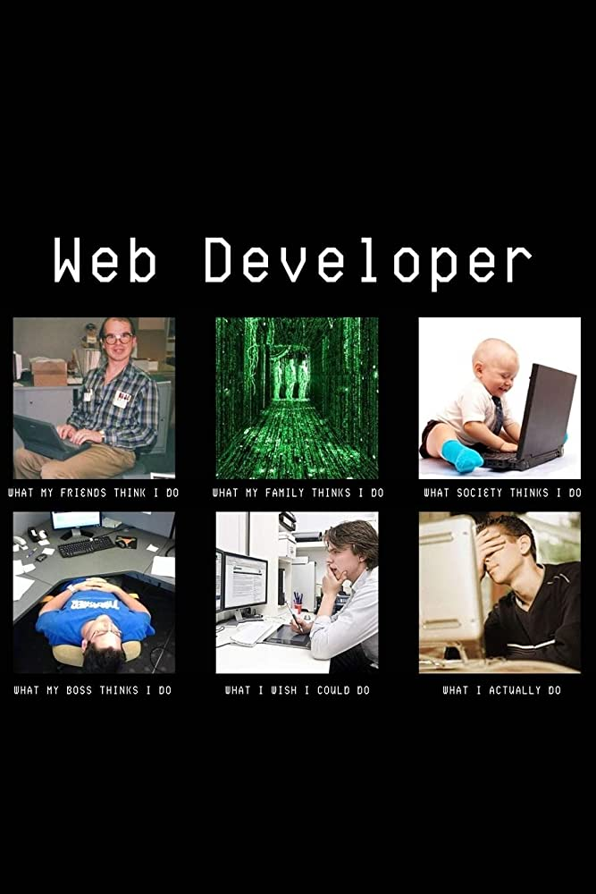

# Group 1

## Introduction

Welcome to the repository of Group 1. This project is a collaboration effort of
Group 1 for the Hack Your Future program.

Our group is on an exciting journey to become web developers through the Hack
Your Future program. We are a team of enthusiastic learners who support each
other in our quest to learn new technologies and foundational concepts.

Together, we are determined to master the skills needed to build amazing web
applications and make a difference in the world. We take on various challenging
projects and assignments, pushing ourselves beyond our comfort zones to become
better developers each day.

We believe that the road to becoming a web developer is not easy, but with
dedication, perseverance, and a supportive community, we can achieve anything we
set our minds to.

## Team Members

The following members are part of our team:

<<<<<<< HEAD

- [Saida](https://github.com/HYF-Class20/workflows-group1-intro/blob/saidakf/groups-bio/saidabio/saidabio.md)
- [Gabriella](https://github.com/HYF-Class20/workflows-group1-intro/blob/master/groups-bio/gabriellalohy.md)
- [Emran](https://github.com/HYF-Class20/workflows-group1-intro/blob/master/groups-bio/info/emran.md)
- [JeanPaul](https://github.com/HYF-Class20/workflows-group1-intro/blob/master/groups-bio/jeanpaul.md)
- [Tesfalem]
- [Starry](https://github.com/HYF-Class20/workflows-group1-intro/blob/master/groups-bio/starry/starry.md)

## Technologies Used

We are using [VScode] as our code editor and [GitHub] as our version control
system.

## What We Have Learned So Far

Through the Hack Your Future program, we have gained invaluable knowledge in web
development technologies such GitHub, Git, VsCode, Node.js, and more. We have
also learned best practices in code quality and continuous integration.

## Code Quality Checks

We have implemented the following code quality checks to ensure that our code is
well-formatted, correctly linted, and free of spelling errors:

- npm run format: Formats all the code in this repository.
- npm run lint:ls: Lints the folder and file names in this repository to ensure
  they match the repo conventions.
- npm run lint:md: Lints all the Markdown files in this repository and flags any
  style mistakes to fix.
- npm run spell-check: Goes through all the files in this repository to look for
  words it doesn't recognize. Correct words can be added to the ./.cspell.json
  file to avoid errors.

## Continuous Integration (CI)

We have set up GitHub Actions to perform linting checks on the code in this
repository when a pull request is made to the main/master branch. If the linting
fails, the PR cannot be merged until the code is fixed. This ensures that our
code is always of high quality and adheres to our established standards.

## Repo Setup

To set up our repository, we have given each member write access to the repo (as
it is a group project), turned on GitHub Pages, and activated GitHub Actions. In
addition, we have set up the following branch protections to ensure the
stability and quality of our code:

- Require a review before pull requests can be merged
- Require status checks to pass before merging
- Require branches to be up to date before merging

We are excited to continue our journey towards becoming successful web
developers through the Hack Your Future program, and we are grateful for the
opportunity to work together as a team to achieve our goals. Require require
branches to be up to date before merging.

## Contributions

We welcome contributions from the community. If you find any issues or want to
add new features, feel free to create a pull request.

## Acknowledgements

We would like to thank our Coaches for their help and support during the
development of this project.

